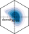
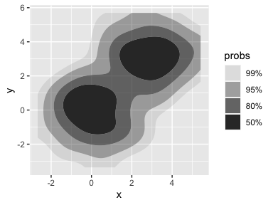

<!-- README.md is generated from README.Rmd. Please edit that file -->

# densityarea <a href="https://jofrhwld.github.io/densityarea/"></a>

<!-- badges: start -->

[](https://github.com/JoFrhwld/densityarea/actions/workflows/R-CMD-check.yaml)
[](https://CRAN.R-project.org/package=densityarea)
[](https://jofrhwld.github.io/densityarea/)
[](https://zenodo.org/badge/latestdoi/691165861)
<!-- badges: end -->

The package `{ggdensity}`[^1] allows for plotting interpretable
bivariate densities by using highest density ranges (HDRs). For example:

``` r
library(tibble)
library(ggplot2)
library(ggdensity)

set.seed(10)
df <- tibble(
  x = c(rnorm(100), rnorm(100, mean = 3)),
  y = c(rnorm(100), rnorm(100, mean = 3))
)

ggplot(df, aes(x,y))+
  stat_hdr()
```



`{densityarea}` gives direct access to these HDRs, either as data frames
or as [simple features](https://r-spatial.github.io/sf/), for further
analysis.

## Installation

You can install `{densityarea}` from CRAN with:

``` r
install.packages("densityarea")
```

Or you can install the development version from
[GitHub](https://github.com/) with:

``` r
# install.packages("devtools")
devtools::install_github("JoFrhwld/densityarea")
```

## Example

The use case the package was initially developed for was for estimating
vowel space areas.

``` r
library(densityarea)
library(dplyr)
library(tidyr)
library(sf)

data(s01)

# initial data processing

s01 |> 
  mutate(lF1 = -log(F1),
         lF2 = -log(F2))->
  s01
```

To get this speaker’s vowel space area we can pass the data through
`dplyr::reframe()`

``` r
s01 |> 
  reframe(
    density_area(lF2, lF1, probs = 0.8)
  )
#> # A tibble: 1 × 3
#>   level_id  prob  area
#>      <int> <dbl> <dbl>
#> 1        1   0.8 0.406
```

Or, we could get the spatial polygon associated with the 80% probability
level

``` r
s01 |> 
  reframe(
    density_polygons(lF2, lF1, probs = 0.8, as_sf = T)
  )
#> # A tibble: 1 × 3
#>   level_id  prob                                                        geometry
#>      <int> <dbl>                                                       <POLYGON>
#> 1        1   0.8 ((-7.777586 -6.009484, -7.801131 -6.010429, -7.824676 -6.01700…
```

## For more

For more details on using `{densityarea}`, see , and for further
information on using spatial polygons, see `vignette("sf-operations")`.

[^1]: Otto J, Kahle D (2023). *ggdensity: Interpretable Bivariate
    Density Visualization with ‘ggplot2’*.
    <https://jamesotto852.github.io/ggdensity/>
    <https://github.com/jamesotto852/ggdensity/>
