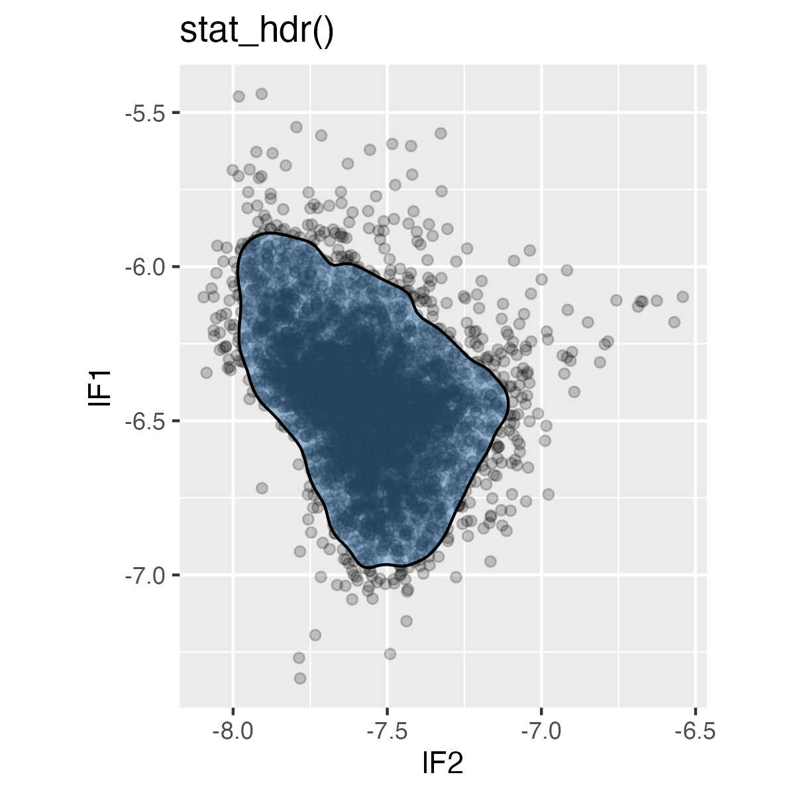
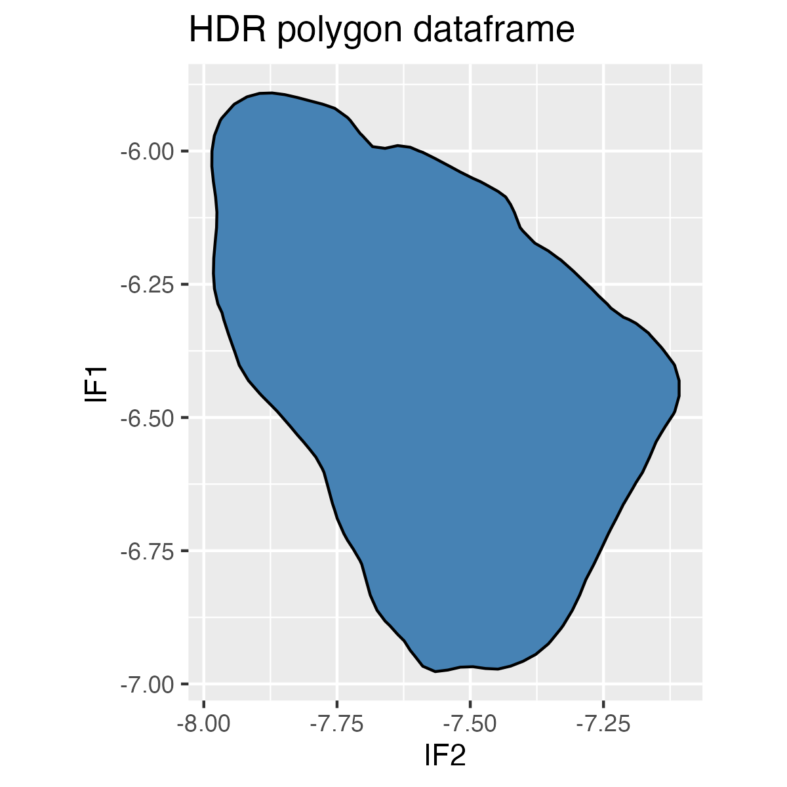

<!-- README.md is generated from README.Rmd. Please edit that file -->

# densityarea

The package `{ggdensity}`[^1] allows for plotting interpretable
bivariate densities by using highest density ranges (HDRs). For example:

``` r
library(tibble)
library(ggplot2)
library(ggdensity)

df <- tibble(
  x = c(rnorm(100), rnorm(100, mean = 3)),
  y = c(rnorm(100), rnorm(100, mean = 3))
)

ggplot(df, aes(x,y))+
  stat_hdr()
```


`{densityarea}` gives direct access to these HDRs, either as data frames
or as [simple features](https://r-spatial.github.io/sf/), for further
analysis.

## Installation

You can install the development version of `{densityarea}` from
[GitHub](https://github.com/) with:

``` r
# install.packages("devtools")
devtools::install_github("JoFrhwld/densityarea")
```

## Example

The use case the package was initially developed for was for estimating
vowel space areas.

``` r
library(densityarea)
library(dplyr)
library(tidyr)
library(sf)

data(s01)

# initial data processing

s01 |> 
  mutate(token = row_number()) |> 
  pivot_longer(F1:F2,
               names_to = "formant",
               values_to = "hz") |> 
  mutate(log_hz_c = -(log(hz)-mean(log(hz)))) |> 
  select(-hz) |> 
  pivot_wider(names_from = formant,
              values_from = log_hz_c)->
  s01_norm
```

### Raw Data

Here’s the raw vowel space data from one speaker with a 90% HDR plotted
over it.

``` r
s01_norm |> 
  ggplot(aes(x = F2, y = F1))+
    geom_point(alpha = 0.2)+
    stat_hdr(probs = 0.9, 
             alpha = 0.5,
             fill = "steelblue",
             color = "black")+
    coord_fixed()+
    labs(title = "stat_hdr()")
```



### HDR Polygons

#### HDR polygon in a data frame.

To get the 90% HDR polygon as a simple data frame, we can use
`densityarea::density_polygons()`. Even though this is just one speaker,
we’ll still `group_by()` the speaker ID for the sake of generalizing to
multi-speaker data.

``` r
s01_norm |> 
  group_by(name) |> 
  summarise(
    poly_df = density_polygons(F2, F1, probs = 0.9)
  ) |> 
  unnest(poly_df)->
  s01_poly_df
```

``` r
s01_poly_df |> 
  ggplot(aes(F2, F1))+
    geom_polygon(fill = "steelblue", color = "black")+
    coord_fixed()+
    labs(title = "HDR polygon dataframe")
```



#### HDR polygon as an sf polygon

We can also get the `sf` polygon objects by setting `as_sf=TRUE`

``` r
s01_norm |> 
  group_by(name) |> 
  summarise(
    poly_sf = density_polygons(F2, F1, probs = 0.9, as_sf = T)
  ) |> 
  unnest(poly_sf) |> 
  st_sf()->
  s01_poly_sf
```

``` r
ggplot(s01_poly_sf)+
  geom_sf(fill = "steelblue", color = "black")+
  labs(title = "HDR sf")
```


#### Multiple probability levels

You can get multiple probability levels at once by passing a vector of
probabilities to `probs`. The base R function `ppoints()` will generate
an evenly spaced number of probabilities.

``` r
s01_norm |> 
  group_by(name) |> 
  summarise(
    poly_sf = density_polygons(F2, F1, probs = ppoints(10), as_sf = T)
  ) |> 
  unnest(poly_sf) |> 
  st_sf() |> 
  arrange(desc(prob)) |> 
  ggplot()+
    geom_sf(aes(fill = prob))+
    labs(title = "Multiple HDRs")
```


### Density Areas

With a few `{sf}` functions, you can get the area of each density
polygon, but there’s also a convenience function in `{densityarea}`,
`density_area()`, that will also do this. It works the same way as
`density_polygons()`.

``` r
s01_norm |> 
  group_by(name) |> 
  summarise(
    areas_df = density_area(F2, F1, probs = ppoints(10))
  ) |> 
  unnest(areas_df)->
  s01_area
```

``` r
s01_area |> 
  ggplot(aes(prob, area))+
    geom_point()+
    geom_line()+
    labs(title = "probability level vs HDR area")
```


You can also preserve the sf polygons in the output.

``` r
s01_norm |> 
  group_by(name) |> 
  summarise(
    areas_sf = density_area(F2, F1, probs = ppoints(10), as_sf = TRUE)
  ) |> 
  unnest(areas_sf) |> 
  st_sf() ->
  s01_area_sf
```

``` r
s01_area_sf |> 
  arrange(desc(prob)) |> 
  ggplot()+
    geom_sf(aes(fill = area))+
    labs(title = "sf polygons' areas")
```


### Leveraging `{sf}`

The `{sf}` package has a lot of operations of potential use for
analyzing these distributions. For example, we can calculate how much
area two categories overlap in.

``` r
s01_norm |> 
  filter(plt_vclass %in% c("o", "oh")) ->
  s01_lowback
```

``` r
s01_lowback |> 
  ggplot(aes(F2, F1, color = plt_vclass))+
    geom_point()+
    stat_hdr(probs = 0.9)+
    scale_color_brewer(palette = "Dark2")+
    coord_fixed()+
    labs(title = "overlap visualization with stat_hdr()")
```


We can get the sf polygons with `density_polygons()`.

``` r
s01_lowback |> 
  group_by(plt_vclass) |> 
  summarise(
    poly_sf = density_polygons(F2, F1, probs = 0.9, as_sf = T)
  ) |> 
  unnest(poly_sf) |> 
  st_sf()->
  s01_lowback_sf
```

``` r
s01_lowback_sf |> 
  ggplot()+
    geom_sf(
      aes(fill = plt_vclass),
      alpha = 0.6
    )+
    scale_fill_brewer(palette = "Dark2")+
    labs(title = "sf HDRs")
```


Now, we can use `sf::st_intersection()` to get back the intersection of
these two HDRs as a new polygon

``` r
s01_lowback_sf |> 
  st_intersection() |> 
  mutate(
    plt_vclass = case_when(n.overlaps > 1 ~ "o~oh",
                           .default = plt_vclass)
  )->
  s01_lowback_intersect
```

``` r
s01_lowback_intersect |> 
  ggplot()+
    geom_sf(
      aes(fill = plt_vclass)
    )+
    scale_fill_brewer(palette = "Dark2")+
    labs(title = "HDR intersections")
```


And we can get the area of each unique region with `sf::st_area()`.

``` r
s01_lowback_intersect |> 
  mutate(area = st_area(geometry),
         prop_area = area/sum(area)) |> 
  ggplot(aes(plt_vclass, prop_area))+
    geom_col(aes(fill = plt_vclass))+
    scale_fill_brewer(palette = "Dark2",
                      guide = "none")+
    ylim(0,1)+
    labs(title = "Proportional areas")
```


[^1]: Otto J, Kahle D (2023). *ggdensity: Interpretable Bivariate
    Density Visualization with ‘ggplot2’*.
    <https://jamesotto852.github.io/ggdensity/,>
    <https://github.com/jamesotto852/ggdensity/.>
